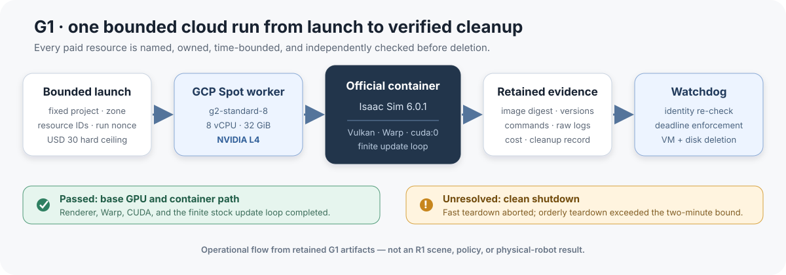

# Unitree R1 Experiment Program

Can a hierarchical robot stack justify its added complexity before anyone gives it access to physical hardware?

This repository turns that question into a safety-gated Unitree R1 simulation program. It combines simulator qualification, exact asset and action mapping, bounded cloud operations, recovery studies, and strict stopping rules. The first cloud infrastructure gate is complete; the next gate is full R1 simulator parity.

> **Safety boundary:** `PHYSICAL_DEPLOYMENT_ALLOWED=false`. No completed result in this repository authorizes physical robot commands.

## G1 result at a glance

| Item | Retained result |
|---|---|
| Simulator | Isaac Sim 6.0.1 official NGC container |
| Worker | GCP `g2-standard-8` Spot VM |
| Accelerator | NVIDIA L4, 23,034 MiB |
| GPU path | Vulkan initialized; Warp selected `cuda:0` |
| Workload | Stock finite headless simulation update loop completed |
| Cost | Far below the campaign's USD 30 ceiling |
| Cleanup | Temporary VMs, disks, networking, roles, bindings, and APIs removed |
| Open issue | Fast teardown aborted; orderly teardown exceeded two minutes |

*Operational flow reconstructed from the retained G1 artifacts. It is not an R1 scene, trained-policy, or physical-robot result.*

## What passed

The run established a reproducible base GPU/container path:

- the pinned `nvcr.io/nvidia/isaac-sim:6.0.1` image ran on an NVIDIA L4;
- the exact image digest, OS image, driver, Docker, toolkit, and disk configuration were retained;
- installing the matching NVIDIA GL package resolved the initial `VK_ERROR_INCOMPATIBLE_DRIVER`;
- Vulkan and Warp initialized on the GPU;
- the stock standalone example completed its finite update loop and printed `Hello World!`;
- two short Spot allocations consumed about 28 minutes total; and
- the ownership-scoped cleanup removed all temporary campaign resources.

The exact environment, commands, and raw-log interpretation are in the [G1 result](artifacts/g1-20260824/RESULTS.md).

## What remained unresolved

The simulation work completed, but process teardown did not exit cleanly:

- fast shutdown aborted with `Destroying busy TaskGroup!`;
- disabling fast shutdown avoided that assertion but exceeded the two-minute orderly-shutdown bound; and
- a writable Hub cache did not resolve the embedded Hub launch failure.

This is a real systems result, not a reason to abandon the program. It changes the next run: use NVIDIA's full Hub deployment or a smaller Isaac Lab application and require a clean zero exit before committing to long jobs.

G1 does **not** establish:

- Isaac Lab functionality;
- a loaded Unitree R1 articulation;
- correct joint order, actuation, collision, or action scaling;
- policy training or manipulation performance; or
- physical deployment readiness.

## Why parity comes before policy training

A visually plausible robot import can still have swapped joints, wrong actuator order, missing collision masks, incorrect gains, or a mismatched home pose. Training on that model would produce an expensive result about the wrong system.

The campaign therefore requires a canonical model contract before learning:

~~~text
pinned Unitree source
        ↓
self-contained MuJoCo model + canonical manifest
        ↓
Isaac import with recorded options
        ↓
joint / actuator / collision / action parity
        ↓
kinematics, reset, standing, and direction probes
        ↓
only then: manipulation and policy experiments
~~~

## Next gate: canonical R1 simulator parity

G2 is an active, bounded engineering gate:

1. Build a canonical R1 manifest from pinned Unitree source.
2. Record every body, joint, geometry, site, actuator, limit, mass, center of mass, inertia, collision policy, gain, home state, and action transform.
3. Materialize a self-contained model rather than relying on loader-side mutation.
4. Import it into Isaac Sim with every importer option recorded.
5. Compare home and three deterministic poses against canonical MuJoCo forward kinematics.
6. Run finite reset and five-second standing probes.
7. Test one actuator group and one joint at a time for ordering and direction.
8. Scale through 1, 16, 64, and 256 environments while stopping before unsafe memory pressure.
9. Retrieve immutable manifests, metrics, logs, hashes, cost, and cleanup evidence.

G1 and G2 share a six-paid-hour cap and the campaign remains under the USD 30 ceiling. If Isaac parity cannot pass inside its attempt, time, or cost gate, the program freezes the classified failure and switches on the same worker to the official Unitree MuJoCo reproduction. It does not create another worker or quietly lower the acceptance criteria.

Passing G2 would establish experimental simulator usability—not cross-engine dynamic equivalence and not physical transfer.

## Repository map

| Path | Purpose |
|---|---|
| [Unitree R1 Codex Prompt.md](Unitree%20R1%20Codex%20Prompt.md) | Ratified gate order, safety contract, metrics, stopping rules, and future experiments |
| [G1 result](artifacts/g1-20260824/RESULTS.md) | Exact environment, commands, outcome, teardown defect, cost, and cleanup |
| [G1 retained artifacts](artifacts/g1-20260824/) | Compact logs and result documentation |
| [Cleanup watchdog](ops/reflect-r1-g1-watchdog.yaml) | Ownership-checked Google Cloud Workflows cleanup |
| [Watchdog test](ops/test_g1_watchdog.sh) | Static fail-closed and authority-scope checks |
| [Design history](docs/superpowers/) | Reviewed specifications and implementation plans |
| [G1 lifecycle diagram](docs/media/g1-bounded-cloud-lifecycle.svg) | Accessible visual summary of the bounded run |

## Verify the cleanup watchdog

The executable check requires Bash and [ripgrep](https://github.com/BurntSushi/ripgrep):

~~~bash
bash ops/test_g1_watchdog.sh
~~~

It verifies that the workflow:

- accepts only the fixed project, permitted zones, exact resource names, numeric IDs, and run nonce;
- rechecks VM and disk ownership immediately before deletion;
- contains no create, start, or stop authority; and
- waits until the supplied deadline before cleanup.

## Safety, cost, and research boundaries

- `PHYSICAL_DEPLOYMENT_ALLOWED=false` throughout the campaign.
- No DDS motor commands or non-loopback robot-controller traffic.
- Exact source, image, asset, configuration, and checkpoint revisions are required before scientific interpretation.
- Tests, imports, and a generated USD count as engineering checks—not rollout evidence.
- Cloud work is bounded by one worker, ownership proofs, an independent cleanup path, shared gate-time limits, and a USD 30 incremental cost ceiling.
- A failed gate produces a classified artifact and a predefined fallback; it does not authorize an improvised expansion in cost or access.

This is an active simulation and operations program with a deliberately narrow completed result. The next useful result is concrete: prove the R1 model and action interface are correct before asking whether any learned controller performs well.
